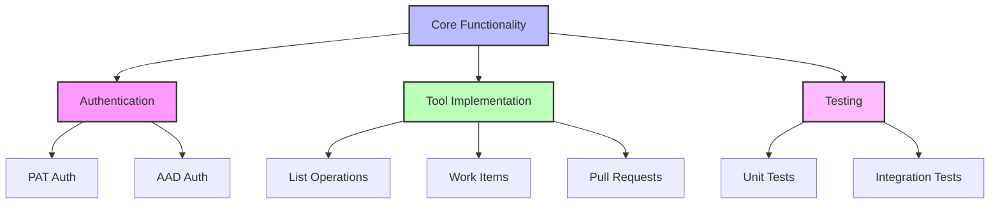
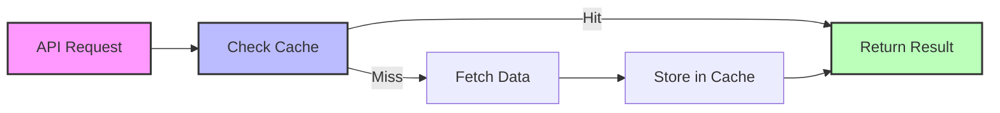

# Active Context: Azure DevOps MCP Server

## Current Development Focus

### Active Development Areas

## Implementation Status

### Core Features
| Feature | Status | Notes |
|---------|--------|-------|
| Server Setup | ✅ Complete | Basic MCP server implementation |
| Authentication | ✅ Complete | PAT and AAD support |
| Project Tools | ✅ Complete | List and get operations |
| Work Items | ✅ Complete | Create, update, list operations |
| Repositories | ✅ Complete | List and get operations |
| Pull Requests | ✅ Complete | Create, update, list operations |
| Documentation | ✅ Complete | README and authentication guide |
| Testing | ✅ Complete | Unit and integration tests |

### Recent Changes
1. **Authentication Implementation**
   - PAT authentication support
   - AAD token-based auth
   - Azure CLI integration

2. **Tool Development**
   - Core navigation tools
   - Work item management
   - Repository operations
   - Pull request handling

3. **Testing Framework**
   - Jest configuration
   - Mock implementations
   - Integration test suite

## Current Decisions

### Technical Decisions
1. **Authentication**
   - Primary: PAT authentication
   - Secondary: AAD support
   - Future: Additional methods

2. **API Integration**
   - Use azure-devops-node-api for core operations
   - Custom Axios client for specific endpoints
   - Rate limiting implementation

3. **Testing Strategy**
   - Unit tests for all tools
   - Integration tests for workflows
   - Mocked API responses

## Active Considerations

### 1. Performance Optimization

- Connection pooling
- Response caching
- Rate limit handling

### 2. Security Enhancements
- Credential management
- Permission scoping
- Input validation

### 3. Error Handling
- Comprehensive error types
- Detailed error messages
- Recovery strategies

## Next Steps

### Immediate Actions
1. **Tool Enhancement**
   - Additional tool implementations
   - Enhanced error handling
   - Performance optimizations

2. **Documentation**
   - Usage examples
   - Troubleshooting guide
   - API reference

3. **Testing**
   - Additional test coverage
   - Performance testing
   - Security testing

### Future Considerations
1. **Feature Additions**
   - Pipeline integration
   - Wiki operations
   - Dashboard tools

2. **Performance**
   - Caching improvements
   - Connection optimization
   - Response compression

3. **Integration**
   - Additional auth methods
   - Custom tool support
   - Plugin system

## Development Environment

### Active Setup
- Node.js v16+
- TypeScript 5.x
- VS Code + Extensions
- Jest + ESLint

### Current Tools
- MCP SDK
- Azure DevOps Node API
- Azure Identity
- Axios

## Knowledge Base

### Key Resources
1. **Documentation**
   - Azure DevOps API Reference
   - MCP Protocol Specification
   - Authentication Guide

2. **Examples**
   - Tool implementations
   - Authentication flows
   - Testing patterns

3. **References**
   - TypeScript guidelines
   - API best practices
   - Security standards

## Issue Tracking

### Known Issues
1. **Authentication**
   - Token refresh handling
   - Permission mapping
   - Error recovery

2. **API Integration**
   - Rate limit enforcement
   - Response handling
   - Error mapping

3. **Tools**
   - Input validation
   - Response formatting
   - Error propagation

### Resolution Status
| Issue | Priority | Status |
|-------|----------|--------|
| Token Refresh | High | In Progress |
| Rate Limiting | Medium | Planned |
| Error Mapping | Low | Under Review |

## Monitoring

### Active Metrics
1. **Performance**
   - Response times
   - Error rates
   - API usage

2. **Security**
   - Authentication failures
   - Invalid requests
   - Rate limit hits

3. **Usage**
   - Tool utilization
   - Request patterns
   - Error frequency

## Communication Channels

### Active Channels
1. **Development**
   - GitHub Issues
   - Pull Requests
   - Documentation Updates

2. **Support**
   - Issue Tracking
   - Documentation
   - Examples
