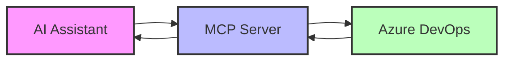
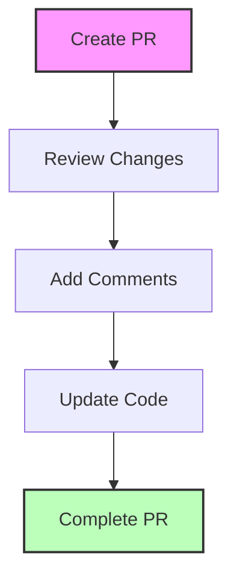

# Product Context: Azure DevOps MCP Server

## Purpose
The Azure DevOps MCP Server addresses the critical need for standardized AI integration with Azure DevOps, enabling AI assistants to interact with development workflows naturally and securely. This bridge between AI models and Azure DevOps enhances development productivity by allowing AI to actively participate in the software development lifecycle.

## Problem Space

### Current Challenges
1. **Integration Complexity**
   - Multiple APIs and authentication methods
   - Varied access patterns and permissions
   - Complex workflow orchestration

2. **AI Integration Barriers**
   - Limited AI access to development context
   - Manual synchronization of work items
   - Fragmented development workflows

3. **Security Concerns**
   - Credential management
   - Access control
   - Audit trail requirements

## Solution Overview

### Key Features
1. **Standardized Access**
   - Unified MCP protocol implementation
   - Consistent tool interfaces
   - Structured data exchange

2. **Comprehensive Integration**
   - Full Azure DevOps API coverage
   - Multiple authentication methods
   - Granular permission control

3. **AI-First Design**
   - Natural language interaction
   - Context-aware operations
   - Workflow automation support

## User Experience Goals

### AI Assistant Perspective
1. **Natural Interaction**
   - Clear tool definitions
   - Structured input/output
   - Error handling with context

2. **Context Awareness**
   - Project structure understanding
   - Work item relationships
   - Repository navigation

3. **Workflow Integration**
   - End-to-end task completion
   - Status tracking
   - Progress reporting

### Developer Perspective
1. **Easy Setup**
   - Clear documentation
   - Simple authentication
   - Minimal configuration

2. **Secure Operation**
   - Controlled access
   - Audit logging
   - Safe defaults

3. **Reliable Performance**
   - Consistent response times
   - Error resilience
   - Rate limit handling

## Use Case Scenarios

### 1. Work Item Management

- Create and update work items
- Track progress and status
- Link related items

### 2. Code Review Process

- Review pull requests
- Provide feedback
- Track changes

### 3. Project Planning

- Create user stories
- Plan iterations
- Track milestones

## Integration Points

### 1. Azure DevOps
- Organizations
- Projects
- Repositories
- Work Items
- Pull Requests

### 2. AI Assistants
- Claude
- Other MCP-compatible AI models

### 3. Development Tools
- VS Code
- Azure DevOps CLI
- Git clients

## Success Criteria

### Functional Success
1. Complete API coverage
2. Reliable authentication
3. Efficient operation

### User Success
1. Easy integration
2. Clear documentation
3. Reliable performance

### Technical Success
1. Test coverage
2. Error handling
3. Security compliance

## Feedback Channels
- GitHub Issues
- Documentation Updates
- Integration Testing
- User Feedback

## Evolution Strategy
1. Core functionality first
2. Iterative enhancement
3. Community-driven development
4. Regular updates and maintenance
