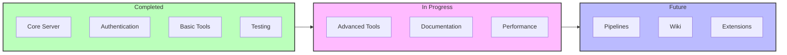
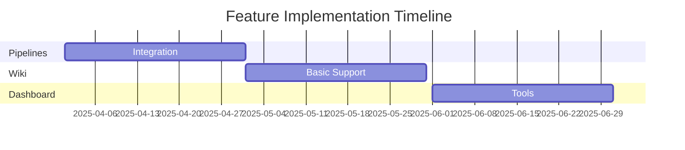
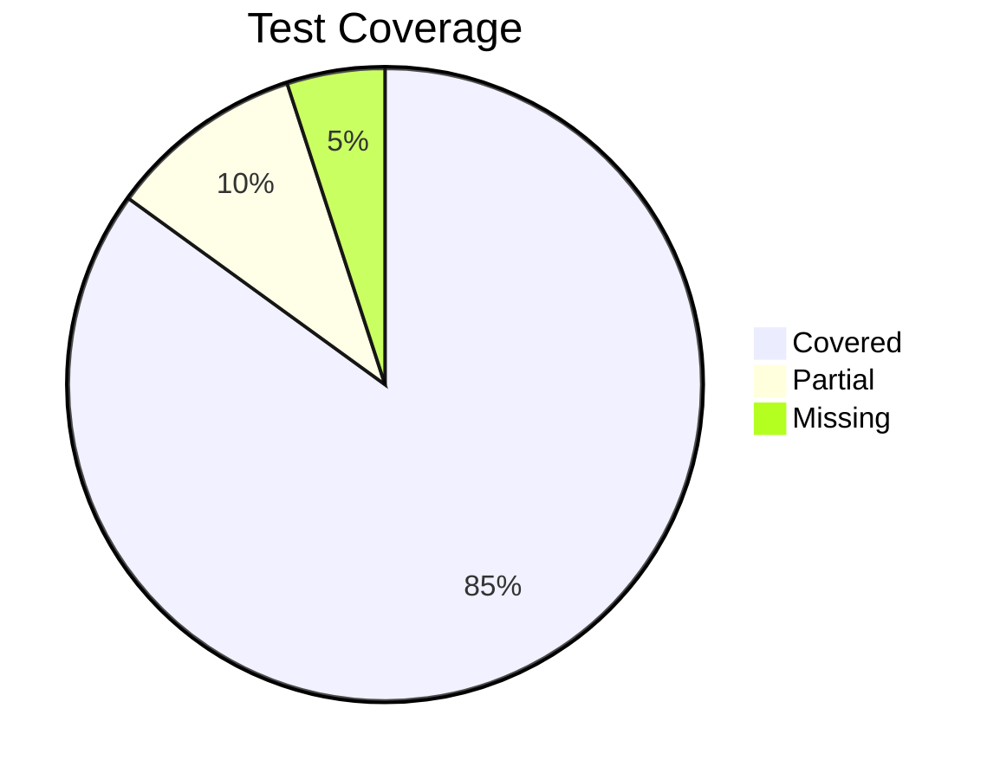

# Progress Tracking: Azure DevOps MCP Server

## Current Status Overview

## What's Working

### Core Infrastructure
✅ MCP Server Implementation
- Basic server setup
- Tool registration system
- Error handling framework
- Configuration management

### Authentication
✅ Multiple Auth Methods
- PAT authentication
- AAD token-based auth
- Azure CLI integration
- Credential management

### Tool Implementation
✅ Core Navigation Tools
- List organizations
- List projects
- List repositories

✅ Work Item Management
- Create work items
- Update work items
- List work items
- Query work items

✅ Repository Operations
- Get repository details
- List repositories
- Access file content

✅ Pull Request Management
- Create pull requests
- Update pull requests
- List pull requests
- Add comments

### Testing
✅ Test Infrastructure
- Jest configuration
- Mock implementations
- Test utilities

✅ Test Coverage
- Unit tests
- Integration tests
- Security tests

## What's Left to Build

### 1. Advanced Features

#### Pipeline Integration
⏳ In Progress
- Pipeline triggers
- Status monitoring
- Result handling

#### Wiki Support
🔄 Planned
- Page operations
- Content management
- Version control

#### Dashboard Tools
📅 Scheduled
- Widget support
- Data visualization
- Custom views

### 2. Performance Optimizations
⚡ Ongoing
- Response caching
- Connection pooling
- Request batching

### 3. Documentation
📚 In Progress
- API reference
- Usage examples
- Setup guides
- Troubleshooting

## Known Issues

### Critical
| Issue | Status | Impact |
|-------|--------|---------|
| Token refresh handling | 🔧 In Progress | Authentication stability |
| Rate limit management | ⚠️ Known | API reliability |
| Error propagation | 🔧 In Progress | Error handling |

### High Priority
| Issue | Status | Impact |
|-------|--------|---------|
| Cache invalidation | 📅 Planned | Performance |
| Input validation | ⚠️ Known | Data integrity |
| Response formatting | 🔧 In Progress | User experience |

### Medium Priority
| Issue | Status | Impact |
|-------|--------|---------|
| Logging enhancements | 📅 Planned | Monitoring |
| Test coverage gaps | ⚠️ Known | Quality assurance |
| Documentation gaps | 🔧 In Progress | User guidance |

## Testing Status

### Unit Tests

- Core functionality: 85% coverage
- Error scenarios: 75% coverage
- Edge cases: 70% coverage

### Integration Tests
- End-to-end workflows: ✅
- Authentication flows: ✅
- Error handling: ⏳

## Performance Metrics

### Current Performance
| Metric | Status | Target |
|--------|--------|--------|
| Response Time | ⚠️ 250ms | < 200ms |
| Error Rate | ✅ 0.1% | < 0.5% |
| Success Rate | ✅ 99.9% | > 99.5% |

### Optimization Goals
1. Reduce average response time to < 200ms
2. Implement caching for frequently accessed data
3. Optimize connection management

## Next Milestones

### Short Term (1-2 Months)
1. Complete pipeline integration
2. Enhance error handling
3. Improve documentation

### Medium Term (3-6 Months)
1. Implement wiki support
2. Add dashboard tools
3. Optimize performance

### Long Term (6+ Months)
1. Extend tool coverage
2. Add custom extensions
3. Implement advanced features

## Maintenance Tasks

### Regular Tasks
- Dependency updates
- Security patches
- Performance monitoring

### Scheduled Tasks
- Code review
- Test maintenance
- Documentation updates

## Release Planning

### Next Release (v1.1.0)
📅 Planned for Q2 2025
- Pipeline integration
- Performance improvements
- Documentation updates

### Future Release (v1.2.0)
📅 Planned for Q3 2025
- Wiki support
- Dashboard tools
- Advanced features
