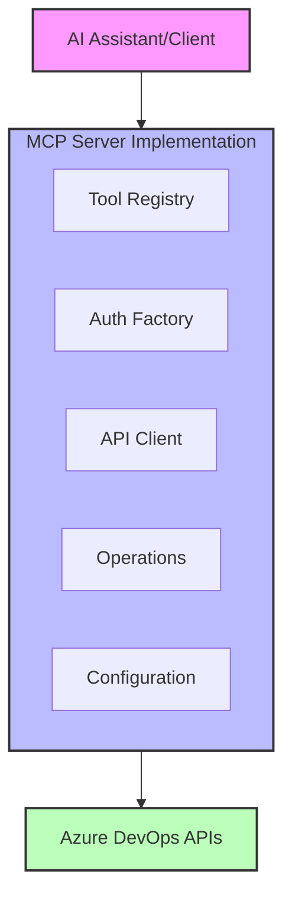
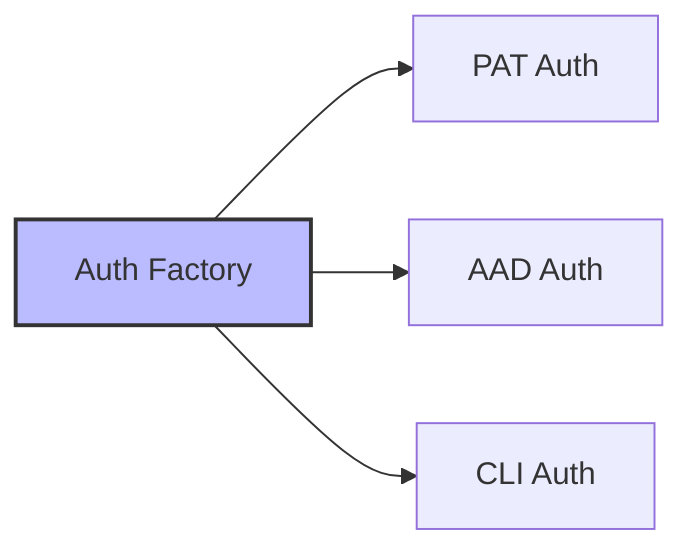
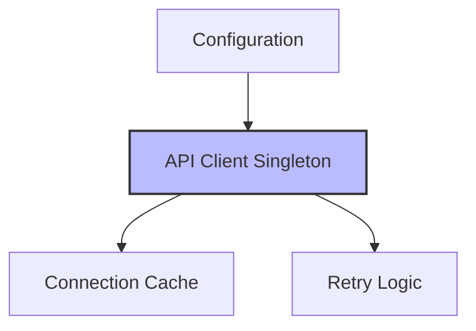
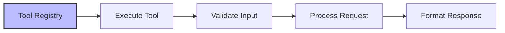
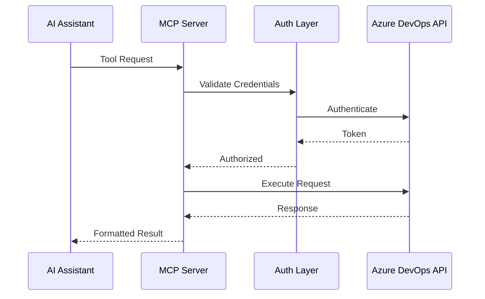
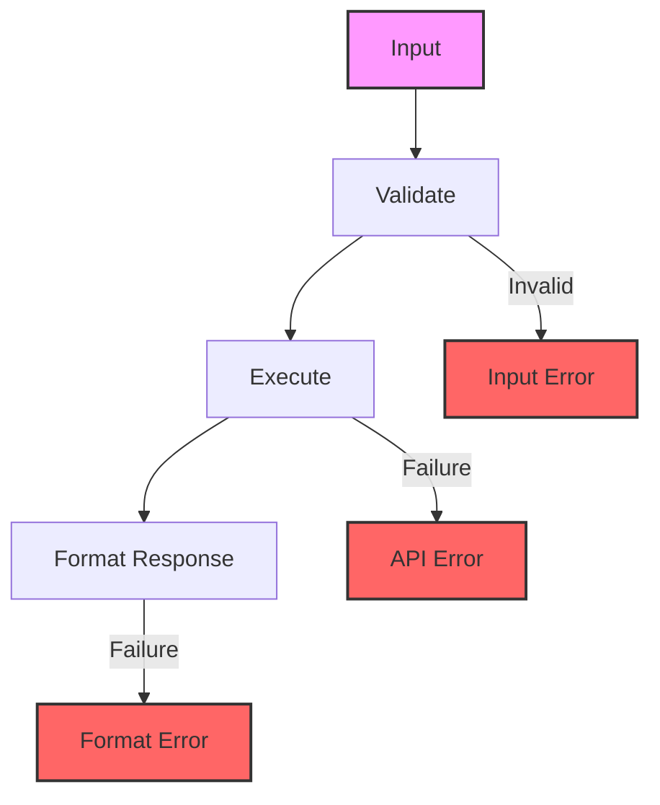
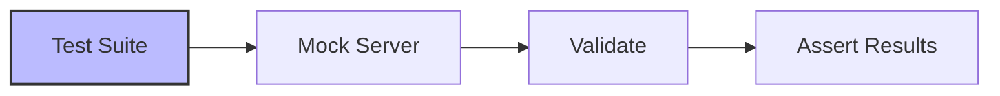

# System Patterns: Azure DevOps MCP Server

## Architectural Overview



## Core Design Patterns

### 1. Factory Pattern (Authentication)


- Centralized authentication handling
- Dynamic auth method selection
- Consistent credential management

### 2. Singleton Pattern (API Client)


- Single API client instance
- Connection pooling
- Resource optimization

### 3. Command Pattern (Tools)


- Standardized tool interface
- Input validation
- Error handling

## Implementation Patterns

### 1. Tool Implementation
```typescript
interface Tool {
  name: string;
  description: string;
  handler: (params: any) => Promise<any>;
  inputSchema: JSONSchema;
}

const createWorkItem: Tool = {
  name: 'create_work_item',
  description: 'Creates a new work item',
  handler: async (params) => {
    // Implementation
  },
  inputSchema: {
    type: 'object',
    properties: {
      // Schema definition
    }
  }
};
```

### 2. Error Handling
```typescript
try {
  const result = await operation();
  return formatSuccess(result);
} catch (error) {
  if (isApiError(error)) {
    return formatApiError(error);
  }
  return formatGenericError(error);
}
```

### 3. Authentication Flow
```typescript
class AuthFactory {
  private static instance: AuthFactory;
  
  static getInstance(): AuthFactory {
    if (!AuthFactory.instance) {
      AuthFactory.instance = new AuthFactory();
    }
    return AuthFactory.instance;
  }
  
  createAuth(type: AuthType): IAuthentication {
    switch (type) {
      case 'pat':
        return new PatAuth();
      case 'aad':
        return new AadAuth();
      default:
        throw new Error('Unsupported auth type');
    }
  }
}
```

## System Components

### 1. Tool Registry
- Central tool registration
- Input validation
- Documentation generation

### 2. Authentication Layer
- Multiple auth methods
- Token management
- Permission validation

### 3. API Client Layer
- Request handling
- Response formatting
- Error management

### 4. Configuration Manager
- Environment variables
- Default settings
- Validation rules

## Communication Patterns

### 1. Request Flow


### 2. Error Handling Flow


## Testing Patterns

### 1. Unit Testing
- Individual tool testing
- Mock API responses
- Error scenarios

### 2. Integration Testing


### 3. Security Testing
- Authentication tests
- Permission validation
- Credential security

## Logging and Monitoring

### 1. Logging Pattern
```typescript
console.error('[Setup] Initializing server...');
console.error('[API] Request to endpoint:', endpoint);
console.error('[Error] Failed with:', error);
```

### 2. Monitoring Points
- API response times
- Error rates
- Authentication failures

## Best Practices

### 1. Code Organization
- Modular structure
- Clear separation of concerns
- Consistent naming conventions

### 2. Security
- Secure credential storage
- Minimal permissions
- Input sanitization

### 3. Performance
- Connection pooling
- Response caching
- Rate limiting

## Evolution Patterns

### 1. Version Management
- Semantic versioning
- Backward compatibility
- Migration support

### 2. Extension Points
- Plugin architecture
- Custom tool support
- Authentication extensibility

## Documentation Patterns

### 1. Code Documentation
- JSDoc comments
- Type definitions
- Usage examples

### 2. Tool Documentation
- Clear descriptions
- Input/output schemas
- Example usage
