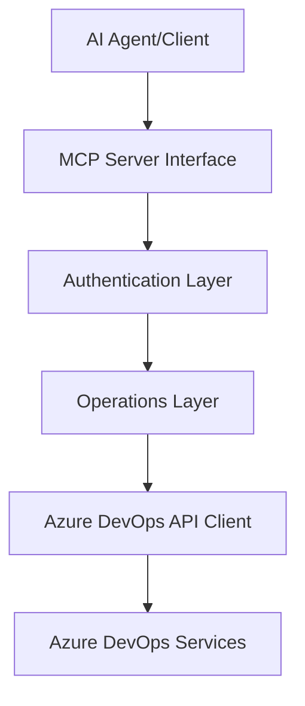
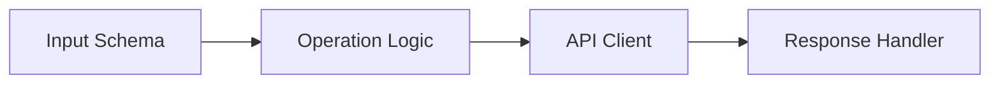
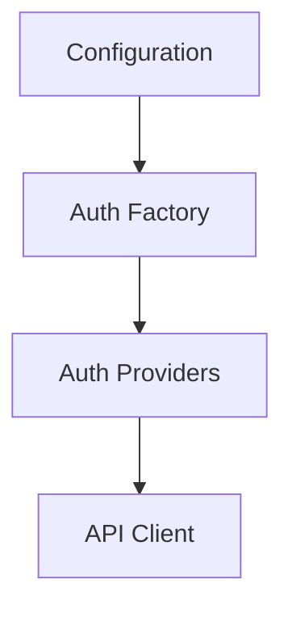
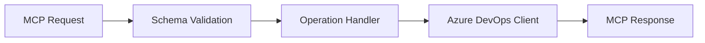

# System Patterns

## Architecture Overview

### MCP Server Architecture


## Core Design Patterns

### Factory Pattern
- `auth-factory.ts`: Creates authentication providers
- `client-factory.ts`: Creates API clients
- Supports multiple authentication methods flexibly

### Operations Pattern
Each operation module follows a consistent pattern:


### Schema-First Design
- All operations define input/output schemas
- TypeScript interfaces match JSON schemas
- Runtime validation ensures type safety

## Component Relationships

### Authentication Flow


### Operation Flow


## Architectural Decisions

### 1. Modular Operation Structure
- Each Azure DevOps feature area has dedicated module
- Operations separated from schemas
- Clear separation of concerns

### 2. Type Safety
- TypeScript throughout
- JSON Schema validation
- Strong typing for API responses

### 3. Error Handling
- Structured error types
- Consistent error patterns
- Clear error messages

### 4. Testing Strategy
- Unit tests for each component
- Integration tests for E2E flows
- High coverage requirements

## Implementation Patterns

### API Client Pattern
```typescript
class ApiClient {
  constructor(auth)
  async request()
  handleResponse()
  handleError()
}
```

### Operation Pattern
```typescript
interface OperationHandler {
  inputSchema: JsonSchema
  execute(params: InputType): Promise<OutputType>
}
```

### Authentication Pattern
```typescript
interface AuthProvider {
  getCredentials(): Promise<Credentials>
  refreshIfNeeded(): Promise<void>
}
```

## Future Considerations
1. Rate limiting strategies
2. Caching layer
3. Batch operations
4. Webhook support
5. Event streaming
