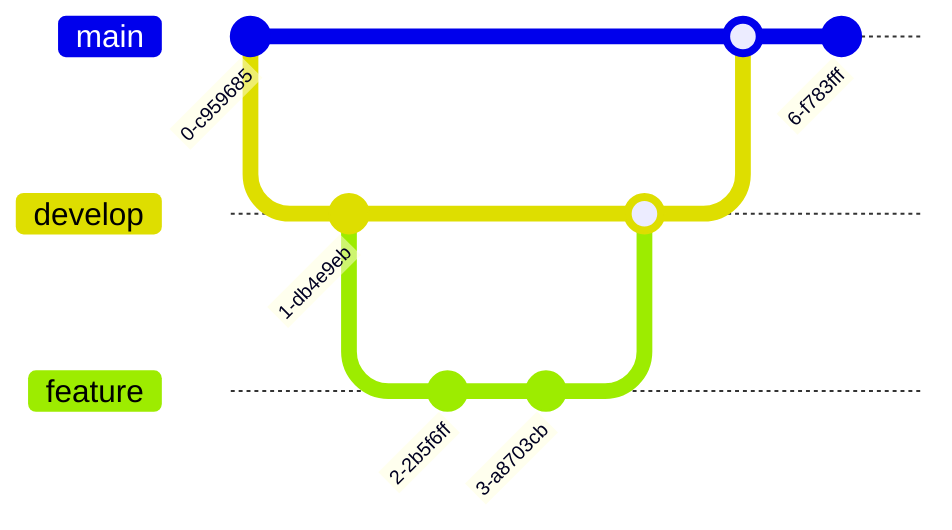

# Technical Context: Azure DevOps MCP Server

## Technology Stack

### Core Technologies


1. **Primary Language**
   - TypeScript 5.x
   - Node.js v16+
   - ES2022+ features

2. **Core SDKs**
   - MCP TypeScript SDK
   - azure-devops-node-api
   - @azure/identity

3. **Development Tools**
   - VS Code
   - ESLint
   - Prettier
   - Jest

## Development Environment

### Setup Requirements
```bash
# Node.js and npm
node --version  # v16+
npm --version   # v8+

# Global dependencies
npm install -g typescript ts-node

# Project initialization
git clone <repository>
cd azure-devops-mcp
npm install
```

### Environment Configuration
```bash
# Core variables
AZURE_DEVOPS_AUTH_METHOD=pat
AZURE_DEVOPS_ORG_URL=https://dev.azure.com/organization
AZURE_DEVOPS_PAT=your_pat_here

# Optional settings
AZURE_DEVOPS_DEFAULT_PROJECT=project_name
LOG_LEVEL=info
```

## Project Structure

### Directory Organization
```
azure-devops-mcp/
├── src/
│   ├── index.ts           # Entry point
│   ├── server.ts          # MCP server implementation
│   ├── api/               # API client implementation
│   ├── auth/              # Authentication handlers
│   ├── operations/        # Tool implementations
│   └── types/            # TypeScript definitions
├── tests/
│   ├── unit/             # Unit tests
│   └── integration/      # Integration tests
├── docs/                 # Documentation
└── package.json          # Project manifest
```

## Dependencies

### Production Dependencies
```json
{
  "@modelcontextprotocol/sdk": "^1.0.0",
  "azure-devops-node-api": "^12.0.0",
  "@azure/identity": "^3.0.0",
  "axios": "^1.0.0",
  "dotenv": "^16.0.0"
}
```

### Development Dependencies
```json
{
  "@types/node": "^16.0.0",
  "@typescript-eslint/eslint-plugin": "^5.0.0",
  "@typescript-eslint/parser": "^5.0.0",
  "eslint": "^8.0.0",
  "jest": "^29.0.0",
  "prettier": "^2.0.0",
  "ts-jest": "^29.0.0",
  "typescript": "^5.0.0"
}
```

## Build and Test Pipeline

### Build Process


### Test Configuration
```javascript
// jest.config.js
module.exports = {
  preset: 'ts-jest',
  testEnvironment: 'node',
  collectCoverage: true,
  coverageThreshold: {
    global: {
      branches: 80,
      functions: 80,
      lines: 80,
      statements: 80
    }
  }
};
```

## API Integration

### Azure DevOps API
- REST API v7.0+
- WebAPI client
- Custom Axios client

### Rate Limiting
```typescript
const rateLimiter = {
  maxRequests: 100,
  perSecond: 60,
  retryAfter: 30
};
```

## Security Configuration

### Authentication Methods
1. **Personal Access Token (PAT)**
   ```typescript
   const patAuth = {
     type: 'pat',
     token: process.env.AZURE_DEVOPS_PAT
   };
   ```

2. **Azure Active Directory (AAD)**
   ```typescript
   const aadAuth = {
     type: 'aad',
     tenantId: process.env.AZURE_AD_TENANT_ID,
     clientId: process.env.AZURE_AD_CLIENT_ID,
     clientSecret: process.env.AZURE_AD_CLIENT_SECRET
   };
   ```

### Permission Scopes
- Read
  - Code
  - Work Items
  - Build
- Write
  - Code
  - Work Items
  - Pull Requests

## Performance Considerations

### Optimization Strategies
1. **Connection Pooling**
   ```typescript
   const pool = {
     max: 10,
     min: 2,
     idle: 10000
   };
   ```

2. **Caching**
   ```typescript
   const cache = {
     ttl: 300, // 5 minutes
     max: 1000 // entries
   };
   ```

## Error Handling

### Error Types
```typescript
type ApiError = {
  code: string;
  message: string;
  details?: any;
};

type AuthError = {
  type: 'unauthorized' | 'forbidden';
  message: string;
};
```

### Logging Levels
```typescript
enum LogLevel {
  DEBUG = 'debug',
  INFO = 'info',
  WARN = 'warn',
  ERROR = 'error'
}
```

## Development Workflow

### Branch Strategy


### Release Process
1. Version bump
2. Changelog update
3. Tag creation
4. Package publishing

## Monitoring and Observability

### Metrics
- Request latency
- Error rates
- API usage
- Authentication failures

### Logging
- Operation logs
- Error traces
- Audit trails

## Technical Constraints

### System Requirements
- Node.js v16+
- npm v8+
- 512MB RAM minimum
- 1GB disk space

### Network Requirements
- HTTPS support
- WebSocket capability
- Outbound connections to Azure DevOps

### Rate Limits
- API calls: 100/minute
- Concurrent connections: 10
- File size: 100MB max

## Maintenance Procedures

### Updates
- Dependency updates
- Security patches
- API version updates

### Backup
- Configuration backup
- Credential management
- State persistence

## Development Guidelines

### Code Style
- Prettier configuration
- ESLint rules
- TypeScript standards

### Testing Requirements
- Unit test coverage
- Integration testing
- Security testing
